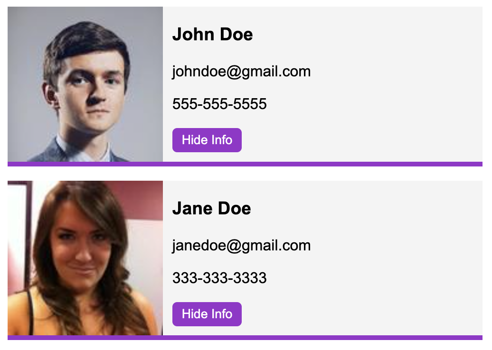

# Web Components Demo

A simple demo of Web Components using:

1. [Custom Elements](https://web.dev/articles/custom-elements-v1)
2. [Shadow DOM](https://web.dev/articles/shadowdom-v1)
3. [HTML Templates](https://web.dev/articles/webcomponents-template)

Based on
[Web Components Crash Course](https://www.youtube.com/watch?v=PCWaFLy3VUo).



### Getting Started

```shell
npm ci
npm start
```

Open a browser window at http://localhost:3000/ to see app.
